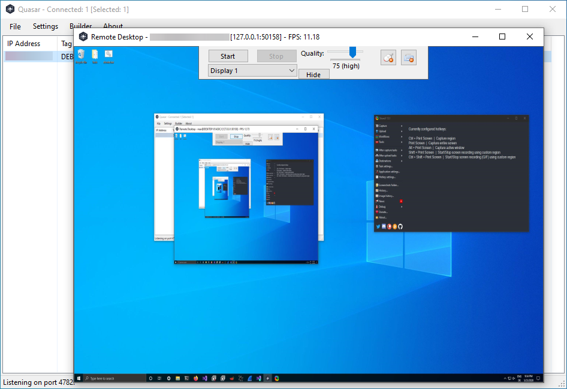

# Quasar DarkShadow Edition [Modded]
Full DS Lite Support for Server and Client and a few more features! (Webcam & Audio)

# Orginal Github Repo: https://github.com/quasar/Quasar

## New Features
 * Remote Webcam
 * Remote Audio
 * DS Lite Support (Full IPv6 & IPv4 Support)
 
## Why ?
I've come across a problem, that if you are on a DS Lite Connection you may won't get any hosts.
This problem exists because the original Quasar triggers and exception when you only define a IPv6-Address because you are on DS Lite.

Clients that do not support IPv6 will fail to connect, if you are on DS Lite and only define a IPv6-Address.

The clients may take longer to connect, but they will connect.

### IMPORTANT: 
Make sure your host IPv6 is the primary one assigned by the router, not the temporary address created by windows.
You can use my version of the DUC No-IP Updater for No-IP Dynamic Hosts: https://github.com/GigaXCodes/NoIP-Updater-IPv6
Use the option "Get public IPv6 from Adapter" 

## Screenshots

## Features
* TCP network stream (IPv4 & IPv6 support)
* Fast network serialization (Protocol Buffers)
* Compressed (QuickLZ) & Encrypted (TLS) communication
* UPnP Support
* Task Manager
* File Manager
* Startup Manager
* Remote Desktop
* Remote Shell
* Remote Execution
* System Information
* Registry Editor
* System Power Commands (Restart, Shutdown, Standby)
* Keylogger (Unicode Support)
* Reverse Proxy (SOCKS5)
* Password Recovery (Common Browsers and FTP Clients)
* ... and many more!

## Supported runtimes and operating systems
* .NET Framework 4.5.2 or higher
* Supported operating systems (32- and 64-bit)
  * Windows 10
  * Windows Server 2019
  * Windows Server 2016
  * Windows 8/8.1
  * Windows Server 2012
  * Windows 7
  * Windows Server 2008
  * Windows Vista
* For older systems please use [Quasar version 1.3.0](https://github.com/quasar/Quasar/releases/tag/v1.3.0.0)

## Compiling
Open the project `Quasar.sln` in Visual Studio 2019+ with installed .NET desktop development features and [restore the NuGET packages](https://docs.microsoft.com/en-us/nuget/consume-packages/package-restore). Once all packages are installed the project can be compiled as usual by clicking `Build` at the top or by pressing `F6`. The resulting executables can be found in the `Bin` directory. See below which build configuration to choose from.

## Building a client
| Build configuration         | Usage scenario | Description
| ----------------------------|----------------|--------------
| Debug configuration         | Testing        | The pre-defined [Settings.cs](/Quasar.Client/Config/Settings.cs) will be used, so edit this file before compiling the client. You can execute the client directly with the specified settings.
| Release configuration       | Production     | Start `Quasar.exe` and use the client builder.

## Contributing
See [CONTRIBUTING.md](CONTRIBUTING.md)

## Roadmap
See [ROADMAP.md](ROADMAP.md)

## Documentation
See the [wiki](https://github.com/quasar/Quasar/wiki) for usage instructions and other documentation.

## License
Quasar is distributed under the [MIT License](LICENSE).  
Third-party licenses are located [here](Licenses).
